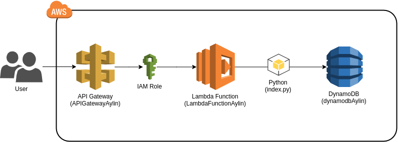

# CLOUDFORMATION EXERCISE (LAMBDA):

AWS Lambda is characterized by lets you run code without provisioning or managing servers. With Lambda, you can run code for virtually any type of application or backend service, all with zero administration. Just upload your code and Lambda takes care of everything required to run and scale your code with high availability. You can set up your code to automatically trigger from other AWS services or call it directly from any web or mobile app.

This repository contains 4 nested stacks that found in different YAML files for the execution of a lambda function from an API Gateway to get and post in dyanamoDB. To access of lambda function we need a Lambda execution role that is defined below. The programation lenguage is Python 3.7.

## Stack-Aylin.yml file:
It is the main file or the root of all nested stacks. In this file the call of the other stacks is made consecutively,
each stack depends of the previous one.

## Stack-Dynamodb.yml file:
This file contains the creation of dynamodb table named tableAylin. It has only one required attribute named "ID" and it has to be a number. It can has more attributes.

## Stack-Lambda.yml file:
This file contains lambda execution role with some policies to access to dynamodb and the lambda function from the API gateway. The lambda function code is in zip file name LambdaFunction.zip. This function can insert and get data of Dynamodb.

## Stack-APIGateway.yml file:
This file has the following parameters:
> - LambdaFunction
> - LambdaExecutionRole

These parameters refer to the ARN of the components returned by the lambda stack. 
This last file contains the API Gateway(RestAPI), the resources (getInformation and postInformation), the methods (GET an POST) attached to the resources and LambdaInvokePermission to able to invoke the lambda function from de api gateway.